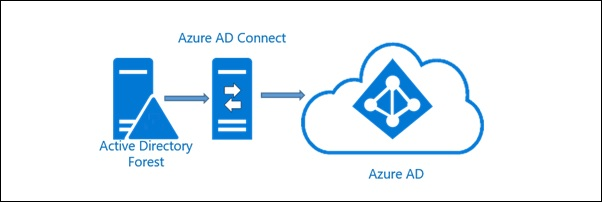

# Azure AD Connect - Testing your installation


## PreRequisite Software
- Install the current stable release of [Pester](https://www.powershellgallery.com/packages/Pester) from PowerShell Gallery

## Tests
 
### PreRequisite tests
> This tests that the server meets all the requirements before the installation begins
- has OS of type - Windows Server 2012 R2 or later
  - has full GUI installed
- has PowerShell Version 3.0 or later installed
- has .NET Framework 4.5.1 or later installed
- the Secondary Logon service is not disabled
- has connectivity with the Internet

```powershell
Invoke-Pester -Script @{Path = '.\.\AADConn.Tests.ps1'; Parameters = @{skip = $True;Mode = 'Primary'}} -Tag PreReqs
```

### Post Installation tests
> This tests that the installation has successfully completed with no errors
- has 'Microsoft Azure AD Connect' listed as installed software
- has 'Microsoft Azure AD Connect synchronization services' listed as installed software
-"has 'Microsoft Azure AD Connect Health agent for sync' listed as installed software
- the 'Azure AD Connect Health Sync Insights Service' is installed and running
- the 'Azure AD Connect Health Sync Monitoring Service' is installed and running
- the AAD Connect auto upgrade state is disabled
```Powershell
Invoke-Pester -Script @{Path = '.\.\AADConn.Tests.ps1'; Parameters = @{skip = $True;Mode = 'Primary'}} -Tag Initial, Install
```

## ADSyncConnector tests
> This tests that the ADLDS_Rules and ADDS_Rules have been set correctly
- has Default Microsoft Rules enabled
- has ADDS (Microsoft) Connector runprofile named correctly
  - Full Import
  - Full Synchronization
  - Delta Import
  - Delta Synchronization
  - Export
- has correct ObjectInclusionList set
- has the correct Attribute set
- ADDS Rule Checks from XML
- ADLDS Rule Checks from XML
- Generic LDAP (Microsoft) Connector check
```Powershell
Invoke-Pester -Script @{Path = '.\.\AADConn.Tests.ps1'; Parameters = @{skip = $True;Mode = 'Primary'}} -Tag ADSync
```
